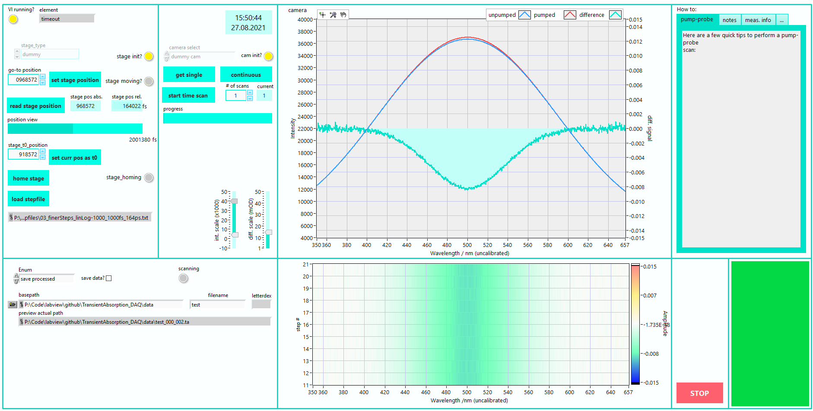

# TransientAbsorption_DAQ
Flexible object-oriented data acquisition Labview software for transient absorption spectroscopy (1x delay stage + 1x detector), written using "Queued Message Handlers" (QMH) to handle routines and data flow, and "Factory Patterns" (FP) to dynamically load hardware classes.

# Overview of block diagram

The front panel shows the most important objects of the project

- Delay stage control panel
- Camera control panel
- Live preview of the camera and difference signals
- 2D plot of difference signal
- parameters for saving the data
- a "How to", "Notes" and "Measurement info" panel
 - the "Measurement info" is saved together with the data

